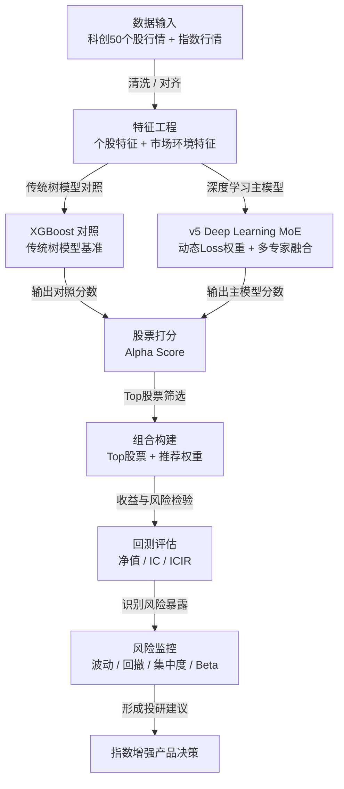
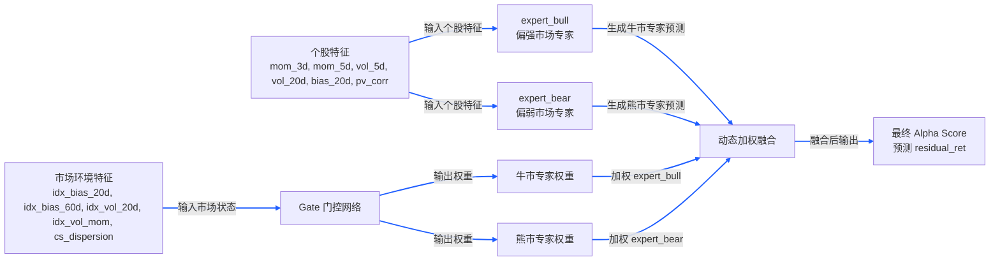
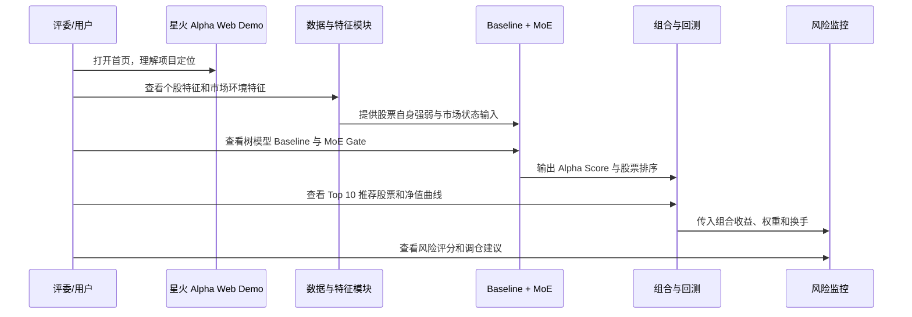

# 星火 Alpha 逻辑流程图 / 交互说明

## 1. 系统整体流程图

```mermaid
flowchart TD
    A[数据输入<br/>科创50个股行情 + 指数行情] -->|清洗 / 对齐| B[特征工程<br/>个股特征 + 市场环境特征]
    B -->|传统树模型对照| C[XGBoost 对照<br/>传统树模型基准]
    B -->|深度学习主模型| D[v5 Deep Learning MoE<br/>动态Loss权重 + 多专家融合]
    C -->|输出对照分数| E[股票打分<br/>Alpha Score]
    D -->|输出主模型分数| E
    E -->|Top股票筛选| F[组合构建<br/>Top股票 + 推荐权重]
    F -->|收益与风险检验| G[回测评估<br/>净值 / IC / ICIR]
    G -->|识别风险暴露| H[风险监控<br/>波动 / 回撤 / 集中度 / Beta]
    H -->|形成投研建议| I[指数增强产品决策]
```

## 2. MoE 模型结构图

```mermaid
flowchart LR
    SF[个股特征<br/>mom_3d, mom_5d, vol_5d, vol_20d, bias_20d, pv_corr]
    MF[市场环境特征<br/>idx_bias_20d, idx_bias_60d, idx_vol_20d, idx_vol_mom, cs_dispersion]
    EB[expert_bull<br/>偏强市场专家]
    EA[expert_bear<br/>偏弱市场专家]
    G[Gate 门控网络]
    WB[牛市专家权重]
    WA[熊市专家权重]
    M[动态加权融合]
    S[最终 Alpha Score<br/>预测 residual_ret]

    SF ==>|输入个股特征| EB
    SF ==>|输入个股特征| EA
    MF ==>|输入市场状态| G
    EB ==>|生成牛市专家预测| M
    EA ==>|生成熊市专家预测| M
    G ==>|输出权重| WB
    G ==>|输出权重| WA
    WB ==>|加权 expert_bull| M
    WA ==>|加权 expert_bear| M
    M ==>|融合后输出| S

    linkStyle default stroke:#1f5eff,stroke-width:2px
```

## 3. 用户使用路径图

```mermaid
sequenceDiagram
    participant U as 评委/用户
    participant APP as 星火 Alpha Web Demo
    participant DATA as 数据与特征模块
    participant MODEL as Baseline + MoE
    participant PORT as 组合与回测
    participant RISK as 风险监控

    U->>APP: 打开首页，理解项目定位
    U->>DATA: 查看个股特征和市场环境特征
    DATA->>MODEL: 提供股票自身强弱与市场状态输入
    U->>MODEL: 查看树模型 Baseline 与 MoE Gate
    MODEL->>PORT: 输出 Alpha Score 与股票排序
    U->>PORT: 查看 Top 10 推荐股票和净值曲线
    PORT->>RISK: 传入组合收益、权重和换手
    U->>RISK: 查看风险评分和调仓建议
```

## 4. 产品架构图

```mermaid
flowchart LR
    subgraph Data[数据层]
        D1[真实 parquet 行情]
        D2[v5 MoE 实验汇总指标]
        D3[Demo mock 兜底]
    end
    subgraph Feature[特征层]
        F1[个股量价特征]
        F2[市场环境特征]
        F3[residual_ret 标签]
    end
    subgraph Model[模型层]
        M1[XGBoost 对照]
        M2[v5 MoE Experts]
        M3[Gate 动态权重]
    end
    subgraph Product[产品层]
        P1[预测排名]
        P2[组合权重]
        P3[回测指标]
        P4[风险评分]
    end
    Data -->|构建训练样本| Feature
    Feature -->|输入模型| Model
    Model -->|输出可执行信号| Product
```
